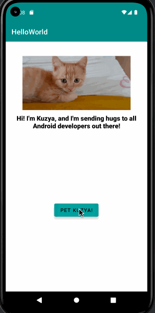

# KotlinProject

# Android Prework - *Kuzya Greeting App*

Submitted by: **Saida Ibragimova**

**Kuzya Greeting App** is an android app that shows an image and introductory message, and allows pressing a button to display a Toast. 

Time spent: **7** hours spent in total

## Required Features

The following **required** functionality is completed:

* [X] Image and introductory message displayed on screen
* [X] Button displayed on screen
* [X] Toast with message appears when button is pressed 

The following **optional** features are implemented:

* [X] Edit the margins of the image for its optimal visibility
* [X] Change the font of the introductory message and increase its weight
* [X] Change the primary color scheme of the app from purple to teal
* [X] Set the setting for the display of Toast to LENGTH_LONG

## Video Walkthrough

Here's a walkthrough of implemented features:

<!-- Replace this with whatever GIF tool you used! -->
GIF created with [LiceCap](http://www.cockos.com/licecap/).  
<!-- Other options include:
[Kap](https://getkap.co/) for macOS
[ScreenToGif](https://www.screentogif.com/) for Windows
[peek](https://github.com/phw/peek) for Linux. -->

## Notes

* I had trouble with using the setOnClickListener: the Android Studio kept throwing an error, despite the fact that my code was identical to the tutorial. Browsing through the StackOverflow and Kotlin Documentation was helpful at resolving the issue. View.onClickListener{} was necessary before the Log.v() command.

## License

    Copyright [2022] [Saida Ibragimova]

    Licensed under the Apache License, Version 2.0 (the "License");
    you may not use this file except in compliance with the License.
    You may obtain a copy of the License at

        http://www.apache.org/licenses/LICENSE-2.0

    Unless required by applicable law or agreed to in writing, software
    distributed under the License is distributed on an "AS IS" BASIS,
    WITHOUT WARRANTIES OR CONDITIONS OF ANY KIND, either express or implied.
    See the License for the specific language governing permissions and
    limitations under the License.
